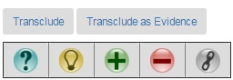

# Structured Conversation in TQPortal #

## Background ##
TQPortal is designed to craft, and with the help of [BacksideServletKS]("https://github.com/KnowledgeGarden/BacksideServletKS"), to maintain a [Topic Map]("https://en.wikipedia.org/wiki/Topic_Maps") of all concepts and relations entailed in user gestures at the portal.

Within that topic map, the platform supports a particular kind of topic map, known as a [Dialogue Map]("http://cognexus.org/id41.htm"). That is, the portal facilitates *conversation*, specifically **structured conversation**. The platform considers that many kinds of topics, including but not limited to the following, can be included in structured conversations: 

- Specific [IBIS](http:// "https://en.wikipedia.org/wiki/Issue-Based_Information_System") conversation nodes 

- Blog posts 

- Wiki topics 

- Bookmarks 

#### IBIS Conversations ####
A structured (IBIS) conversation consists of nodes organized in a tree structure (parent-children nodes), anchored in some *root node*.The TQPortalKS implementation of IBIS conversations enables these specific node types:

- Map:  which serves as a container for a specific conversation

- Question (Issue):  which poses a question, or refines another question (if its parent node is another question)

- Answer (Position):  which responds to a question, or which can refine another answer (if its parent node is another answer)

- Pro argument:   which offers supporting claims and evidence for its parent node

- Con argument:   which offers counter claims and evidence for its parent node

- Reference:   which can contain a URL to some resource which relates to a parent node

An IBIS conversation is typically anchored in some root. The primary root types for TQPortal are these:

- A Map node created to anchor a conversation. Its child node is typically a Question node, which then anchors the rest of the conversation

- A Blog post can serve as an anchor, in the same sense that blog posts typically enable *comments* fields

- A Wiki topic cn serve as an anchor

- A bookmark, which represents an annotation collected from a specific website, can serve as an anchor

#### Transclusion ####
[Transclusion](http:// "https://en.wikipedia.org/wiki/Transclusion") is a process which allows any (excluding nodes of type User and type Tag) to be *copied by reference* and dropped into any conversation.  This process allows a node used in one conversation, be it an IBIS, blog, wiki, or bookmark node, to be used again in another conversation.

## ISSUES ##

The tranclusion capability means this:

- Every node must maintain specific tracking of its parent node, and the conversation in which that parent node exists.

We call that pair:

- Parent/Context

## IMPLEMENTATION ##
The present user interface enables conversation through buttons which look like these:  

Those buttons will appear on any topic view under these conditions:

- The user is authenticated

- The topic of of the type which can participate in conversations. Presently, the only topic types which cannot participate in conversations are Tags, and Users

We provide these reply capabilities:

- Transclusion of this topic into another conversation

- IBIS responses.

Note that we do not (presently) provide a Map node as a response type.  To create a new Map -- that is, a new conversation, there is a **New Conversation** button available on the Conversation app.

Starting with the view, response buttons are painted only in the file /views/ctopic.hbs

The buttons are formed with a hyperlink which looks like the following:

&lt;a href="/newquestion/{{locator}}?contextLocator={{context}}">

To paint that view, consider the file /routes/blog.js and specifically the function **app.get('/blog/:id'**...  The view required two data objects: locator and context. That function specifically sets those values. In this case, when a user is viewing a blog topic on its own, the blog is its own context.

Determining context, however, is non-trivial. If a blog post is being viewed in the context of a conversation, that is presently generated from the MillerColumn navigator widget. If a blog post is simply called from a pivot, then it generates itself as the context.

